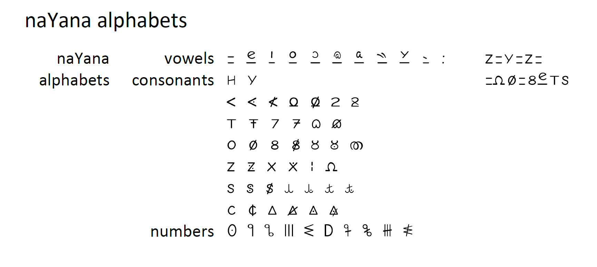
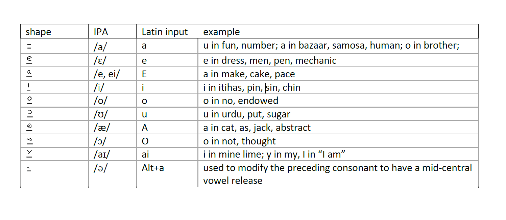
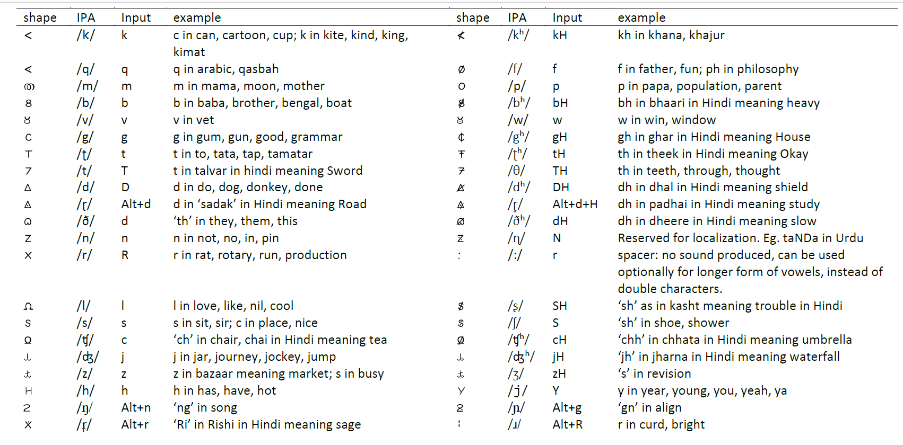

--- 
layout: default
title: naYana
description: an alphabet for universal literacy
---
# naYana

The naYana phonetic alphabet is created by Nagarjuna G. and Vickram Crishna and few other collaborators and interns at the gnowledge lab (https://www.gnowledge.org) of Homi Bhabha Centre for Science Education (https://www.hbcse.tifr.res.in), Tata Institute of Fundamental Research (TIFR) at Mumbai in India (See full credits below). The current version is a result of iterative development that started around 2012. The protoype OTF font for the alphabet with latin keyboard mapping is designed and developed by Nagarjuna G.[Download the OTF font.](../assets/fonts/naYanakamikRegular.otf)

The ability to produce a variety of vocalizations and other sounds through the buccal cavity gives human beings, so to speak, a speech engine. According to Ethnologue there are over 7000 different languages spoken around the world. If we take IPA (International Phonetic Alphabet) as an indication of the variety of vocalizations that we can generate, we have about 107 sound symbols for each phoneme, plus about 50 diacritics generating variations of the sounds and a few intonations. None of the languages use all of them.  For example, English uses only about 24 consonants and 20 vowel forms  to produce variations;  Hindustani has about 28 consonants and about 8 vowels. Taa language, spoken in Botswana, is considered to have the largest number of phonemes including non-vocal click sounds, with about 60 consonants and about 30 vowels. Each of these phonemes need a corresponding alphabet, and IPA does provide that.  However, IPA is a linguistic exercise and not developed for literacy.  There are some attempts to make the IPA encodable within 7-bit ASCII range, e.g. X-SAMPA (https://en.wikipedia.org/wiki/X-SAMPA), which is now used mostly as an input method for IPA. 	If universal literacy is the motive, we need a script that is easy to learn, easy to learn another language. extendable and localizable without violating the design principles, and finally preserving and provisioning for the diversity of expression.

 - We followed the embodied nature of how the sounds are produced by us using the dynamic configurations facilitated by the dexterous movement of the lips, tongue, palate, teeth along with the modulated flow of breath through the vocal chords. Though some of the shapes of alphabets are arbitrary, most of the basic phonemes are linked to the form of the buccal configurations.

 - Apart from the embodied nature of the alphabet, the vital feature of the alphabet is: no shape is reused by symmetric transformations (rotation or mirror forms) unless they are required semantically as in the case of brackets. This is specifically imposed as a design principle to ensure that no child is punished for their intuitive grasp of the shape while learning. Rotated or mirrored alphabets are valid within the naYana script, which may also give font designers great freedom in defining ligatures, kerning, positional and substitution rules (possible in an OTF font) to turn the script look easthetic as well. This is one of the motivations of calling the script by a phonetic palindrome, nYn, which in Sanskrit means eye. (The name was suggested by Rafikh Shaikh.) Arguably this may be one of the first comprehensive scripts ever designed using this principle, which will not lead to a form of dyslexia arising out of inability to distinguish symmetric variations.

 - Some sounds are sharp and some are not. We tried to keep sharper edges in the shape to indicate this representation, and curved or round shapes for the others.Most scripts created by human beings so far attempted to give a recognizable character to the alphabets, which helps us to identify the script, even if we cannot read. For example, roman, dravidian, hindustani, persian, chinese scripts have a distinct character. While preserving the unique character of these scripts, these scripts make learning the script difficult, because most of the alphabets are created by a slight variation from one another. If we wish to reduce learning time, we can drop this temptation to preserve identity. Thus naYana alphabets are borrowed from shapes from around the world, celebrating plurality within a single script.

 - The script can be written from left to right, or from right to left, or top down, only the writer and the reader need to know the order. As a proposed universal alphabet, this could be a factor for universal adoption.

 - It is the defining feature of vowels to let the breath flow through. So we left a gap in the alphabet to represent this. We represented all vowels with a horizontal stroke with modifiers on top leaving a gap, for the air to pass through, so to speak.

 - Modifiers can be used depending on how the script is written. The script can be linear, or composite. In the case of composite script, the vowel markers sit on top of the consonants. For example, many of the Indian langauge scripts, which use non-linear script would find this model useful.

 - Localized interpretations can be made for each language or dialect.

The end result: a script where learning to spell a word is made redundant, and no spelling olympiads can be held.

A word about celebrating cultural variation. Often we hear arguments that any attempt at a universal code goes against human history and cultural variation. Common code does not eliminate diversity of expression within a wider population, on the other hand it becomes a base for inclusive participation. Trascriptional unity can generate translational diversity is well evidenced by a common genetic code, where four letters and 64 words generated the organic diversity which is key for organic evolution. We hope naYana project will enhance cultural diversity and localization through transciptional unity and universal literacy.

## naYana alphabets

Figure 1: naYana alphabets. The vowel set followed by the consonants which are grouped into six categories, and the numbers are grouped into 0-9.

Most of the shapes used in the design of naYana alphabet are widely available within the very large unicode set of most common fonts. Some of the shapes are created by rotating them, and by doing a union or diffrence operation of the outlines from existing shapes. No distinction between capital and small letters is proposed. The prototype font (naYanakamik is derived from Comik Neue Regular) 

## Vowels

Vowels are produced by free passage of breath through the oral cavity. All vowels are created by a shape that closely resembles the sound, placed above a horizontal line with a gap, representing the free passage of breath. The modifiers placed on top of the horizontal line are chosen intuitively and inspired from existing usage.

Table 1: vowels chart indicating the IPA mapping, proposed input character for typing on a regular QWERTY keyboard and examples.

Additional vowel forms can be created by a combination of the base vowels, e.g. au, oi, ui, ae, ea ou etc. When necessary localized interpretations can be defined for each langauge or dialect.

## Consonants 
Sharper contact at the end of the palate genetates /k/, therfore <u>k</u> is chosen. A softer blunter variation of <u>k</u> generates /g/, hence <u>g</u>. Few of the first consonant vocalization generated by infants are various bilabial sounds. Starting with simple <u>p</u> for /p/, <u>f</u> for /f/, <u>b</u> for /b/, and <u>m</u> for /m/ is proposed. Since /b/ and /v/ are closer sounds, while the latter is produced by open lips to leave a little space for the air passing through,  we created <u>v</u> by opening <u>b</u>. The /ʈ/ is generated when tongue touches the palate almost at the middle, so <u>ʈ</u> is chosen, and toungue touching the teeth gives us /t/, so we chose <u>t</u>. For /d/ we chose capital delta from the greek letters, because it needs a sharper shape, and for /ð/ a rounded and smoother form of delta, a rounded heart shape <u>ð</u>. /d/ and /ɽ/ are the versions of each other, the first being a retroflexive stop and latter one being a retroflexive flap, therfore for /ɽ/, <u>ɽ</u> with a dot is chosen. <u>l</u> shape is chosen for /l/; a crossed <u>R</u> for /r/; <u>s</u> for /s/; <u>Y</u> for /j/; <u>n</u> for /n/ were chosen from the widely used simple shapes./ʂ/ and /ʃ/ sounds closer but in /ʂ/ the tongue is rolled back and in /ʃ/ the tongue is held straight and stream of air is directed towards closely held teeth and hence symbols are <u>ʂ</u>, <u>ʃ</u> are chosen respectively. /t̠ʃ/ is produced when tongue flatly touches the palate, hence <u>c</u>. <u>j</u>,<u>z</u> are made with slight variation of j for /d͡ʒ/ and /z/ respectively. The /z/ and /ʒ/ sounds similar, however for /z/ the air flows through your front teeth and for /ʒ/ the air flows through your side teeth, so we created <u>ʒ</u> by adding dot in <u>z</u>. The choice of H for /h/ is intuitive, also being at the margin of being a vowel and a consonant, created by linking the roof and the floor. By inserting modifiers to this basic set of consonants, we can create localized versions as and when necessary. The aspirated version of /k/ generates /kh/ therefore <u>kh</u> is chosen. Similarly the aspirated versons of /b/, /g/, /ʈ/, /d/, /ɽ/, /ð/, /ʧ/ geneartes /bh/, /gh/, /ʈh/, /dh/, /ɽ̥h/, /ðh/, /ʧh/ respectively, therefore the symbols with srikes <u>bh</u>, <u>gh</u>, <u>ʈh</u>, <u>dh</u>, <u>ɽ̥h</u>, <u>ðh</u>, <u>ʧh</u> are created. The combination of <u>z</u> and <u>g</u> produces /ŋ/ sound which is called the “velar nasal,” which means that you curl your tongue up against the back of our mouth and the air comes out your nose, therefore <u>ŋ</u> is created. The /ɲ/ represents a palatal nasal and therefore, <u>ɲ</u> is chosen. The <u>r̩</u> is chosen for /r̩/. As and when necessary, more simple shapes can be inserted into the alphabet, holding to the above design principles.

## Numbers 

The number shapes were created keeping semantics of the decimal number system. 6-9 are created by inserting stroke modifer of 1-4. The number 5 is represented as half of 10, hence D. The need to create special symbols for numbers is arising from using some of the number shapes for the consonants, e.g. <u>s</u>, <u>m</u> and <u>T</u> for /s/, /m/ and /ɵ/.

Table 2: Consonants with the shape, IPA phoneme mapping, proposed input character for typing on a regular QWERTY keyboard, with examples.

## UDHR transcripts
Article 1 of Universal Declaration of Human Rights is transcribed in multiple langauges below:

**Standard English Spelling for Universal Declaration of Human Rights** 

All human beings are born free and equal in dignity and rights. They are endowed with reason and conscience and should act towards one another in a spirit of brotherhood. (Article 1 of the Universal Declaration of Human Rights)

**QWERTY keyboard input for Article 1 of UDHR** 

aal hYuman biings ar barn frii anD iikval in Digniti anD Ryts. de ar enDoveD viT Riizan anD kansyens anD SuD Akt tuvarDz van enader in a spiRit af braderhud.

**naYana transcript for UDHR** 

<h5>aal hYuman biings ar barn frii anD iikval in Digniti anD Ryts. de ar enDoveD viT Riizan anD kansyens anD SuD Akt tuvarDz van enader in a spiRit af braderhud.</h5>

**Article 1 of UDHR in Hindi**

सभी मनुष्यों को गौरव और अधिकारों के मामले में जन्मजात स्वतन्त्रता और समानता प्राप्त है । उन्हें बुद्धि और अन्तरात्मा की देन प्राप्त है और परस्पर उन्हें भाईचारे के भाव से बर्ताव करना चाहिए ।

səb̤iː mənuʂjon ko ɡɔːrvə ɔːrə ad̤ikaːron ke maːmle men d͡ʒənməd͡ʒaːtə svətntrətaː ɔːrə səmaːntaː praːptə ɦæː । unɦen budd̤i ɔːrə antəraːtmaː kiː denə praːptə ɦæː ɔːrə pərspərə unɦen b̤aːiːt͡ʃaːre ke b̤əavə səe bərtəavə kərnəa t͡ʃəaɦəie ।

<h5>sabhir manuSYoko gauRav auR adhikaRon ke marmle me janmajaaT svaTanTRaTa aur samaanTa pRapT hai. unhebuddi auR anTRaTmar kii den prapT hai auR paRaspaR unhe bhaircarRe ke bhav se baRTav kaRna carhiYe.</h5>

**Article 1 of UDHR in Marathi**

सर्व मानवी व्यक्ती जन्मतः स्वतंत्र आहेत व त्यांना समान प्रतिष्ठा व समान आधिकार आहेत. त्यांना विचारशक्ती व सदसद्विवेकबुद्धी लाभलेली आहे व त्यांनी एकमेकांशी बंधुत्वाच्या भावनेने आचरण करावे.

sərvə maːnviː vjəktiː d͡ʑənmətəh svətəntrə aːɦetə və tjaːnnaː səmaːnə prətiʂʈʰaː və səmaːnə aːd̤ikaːrə aːɦetə. tjaːnnaː vit͡ɕaːrəɕəktiː və sədsədvivekbudd̤iː laːb̤leliː aːɦe və tjaːnniː ekmekaːnɕiː bənd̤əutvəat͡ɕjəa b̤əavnəenəe aːt͡ɕərɳə kərəavəe.

<h5>saRva maanavi vYakti janmaTaha svaTanTRa aahet va TYaannaa samaan pRatiSthaa va samaan adhiKaaR aaheT. Tyanna vicaRSakTi va sadsadvivekbuddhi laabhaleli aahe va Tyanni ekmekarnSi bandhutvacyaa bhaavanene aacaRaN kaRaave.</h5>

**Article 1 of UDHR in Telugu**

ప్రతిపత్తిస్వత్వముల విషయమున మానవులెల్లరును జన్మతః స్వతంత్రులును సమానులును నగుదురు. వారు వివేచన-అంతఃకరణ సంపన్నులగుటచే పరస్పరము భ్రాతృభావముతో వర్తింపవలయును.

prət̪ɪpət̪t̪ɪsʋət̪ʋəmʊlə ʋɪʂəjəmʊnə manəʋʊlellərʊnʊ d͡ʒənmət̪əh sʋət̪ənt̪rʊlʊnʊ səmanʊlʊnʊ nəɡʊd̪ʊrʊ. ʋarʊ ʋɪʋeːt͡ʃənə-nt̪əhkərəɳə səmpənnʊləɡʊʈət͡ʃeː pərəspərəmʊ b̤rat̪rub̤aʋəmʊt̪əoː ʋərt̪əɪmpəʋələjəʊnəʊ.

<h5>pRaTipaTTisvaTvamula viSaYamuna maanavulellaRunu janmaTaha svaTanTRulunu samaanulunu naguduRu. vaaRu vivercana-anTahakaRaNa sampannulagutacEr paRaspaRamu bhRaTRubhavamuTo vaRTimpavalaYunu.</h5>

**Article 1 of UDHR in Sanskrit**

सर्वे मानवाः स्वतन्त्राः समुत्पन्नाः वर्तन्ते अपि च, गौरवदृशा अधिकारदृशा च समानाः एव वर्तन्ते। एते सर्वे चेतना-तर्क-शक्तिभ्यां सुसम्पन्नाः सन्ति। अपि च, सर्वेऽपि बन्धुत्व-भावनया परस्परं व्यवहरन्तु।

sərve maːnvaːəh svətntraːəh səmutpənnaːəh vərtənte api t͡ʃə, ɡɔːrvədr̩ʃaː ad̤ikaːrdr̩ʃaː t͡ʃə səmaːnaːəh evə vərtənte। ete sərve t͡ʃetnaː-tərkə-ʃəktib̤jaːn susmpənnaːəh sənti। api t͡ʃə, sərveऽpi bənd̤utvə-b̤aːvnəjəa pərspərən vjəvɦərntəu।

<h5>saRve maanavaaha svaTanTRaaha samuTpannaaha vaRTanTe api c, gauRavdRuSaa adhiKaaRdRuSa c samaanaaha eva vaRTanTe. eTe saRve ceTanaa-TaRka-Saktibhyaam susampannaaha sanTi. api c, saRverpi bandhuTva-bhaavanayaa paRaspaRam vyavahaRanTu.</h5>

## Credits
**Credits Authors**:Nagarjuna G. and Vickram Krishna

**Author of naYanakamikRegular font**: Nagarjuna G. [Download the OTF font](../assets/fonts/naYanakamikRegular.otf)

**Name for the alphabet given by**: Rafikh Shaikh

**Transcription of UDHR in Marathi and Sanskrit**: Spruha Satavlekar

**Transcription of UDHR in Telugu**: Nagarjuna G.

**Student interns**: who worked iteratively testing the idea: Smriti Rao, Deepa ramrakhani, Prachi Rahurkar, Sonal Bhavsar, Afrin Pinjari, Pooja Naik, Johnson Shetty, Kabir Kukreti, Vikas Balani, Tushar Garg, Ruchir Jain, Vinay Jain and several others.

Translations of UDHR taken from https://unicode.org/udhr/index.html

21st July 2020
